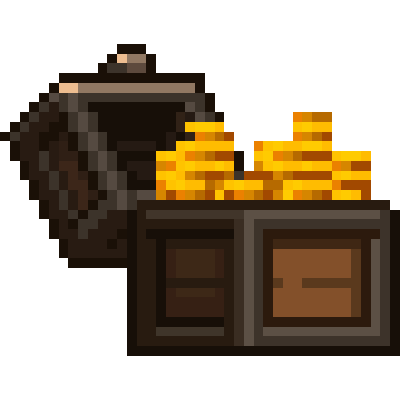

<p align="center">
  
  <br><br>
  
  &nbsp
  
  &nbsp
  
  <br><br>
  <a href="https://modrinth.com/mod/mercantile"></a>
  &nbsp
  <a href="https://www.curseforge.com/minecraft/mc-mods/mercantile"></a>
</p>

# 🪙 Mercantile

This mod adds a simple currency to Minecraft: copper, silver and gold coins (configurable).
While holding a coin and right-clicking, its value will be stored in your "purse".
You can get the coins back by clicking the respective buttons in your inventory.

There is no way to get the items (currently), apart from creative mode or commands.
This means, you'll have to come up with your own economy system for your server. \
Some ideas:
- Admin shops, exchanging goods (e.g. Wheat) for coins
- Add coins to chest loot tables using KubeJS + LootJS (this works best with the Lootr mod, so everyone has a chance to loot coins)
- Coins as quest rewards (using something like FTB Quests)

## Create Shopkeeper Integration

If you have Create 6+ installed, this mod will enable you to pay super easily with your stored coins at shopkeepers!
Any coins you have in your inventory will be stored before the purchase. \
Here is how such an interaction might look like ingame:


## Adding your own coins

The mod provides standard textures and item models for copper, silver and gold coins (with different textures depending on the item stack size). \
(I am no artist, so I used existing textures from the Thermal Series mods made by Team CoFH.)

If you add any other coins you need to also provide a resource pack with corresponding textures and item models for these items.
You may also want to add the `#mercantile:coin` tag to any new coins using a datapack or something like KubeJS.

### Example

If you want to add a platinum coin, you first need to declare it and its value in the `config/mercantile-common.properties` config file.
You can do this by adding this line to the file:
```properties
platinum = 10000
```

>Note: The coin definitions in this file need to be the same on client and server.

This creates a `mercantile:platinum_coin` item with a value of 10,000.

Now you need to provide a resource pack with the corresponding textures and item models. \
An example for such a resource pack is provided for this specific example in the [GitHub repository](https://github.com/kvnmtz/mercantile/tree/main/resourcepack-example).

## Tips for modpacks

- Include a way to get coins
- If you use the default textures and have Thermal Series mods installed, you may want to remove the recipes for Thermal's own coins using something like KubeJS:
  ```js
  ServerEvents.recipes(event => {
    event.remove({ input: /^thermal:.+_coin$/ });
    event.remove({ output: /^thermal:.+_coin$/ });
    event.remove({ id: /^thermal:machines\/press\/press_.+_to_coin$/ });
  });
  ```